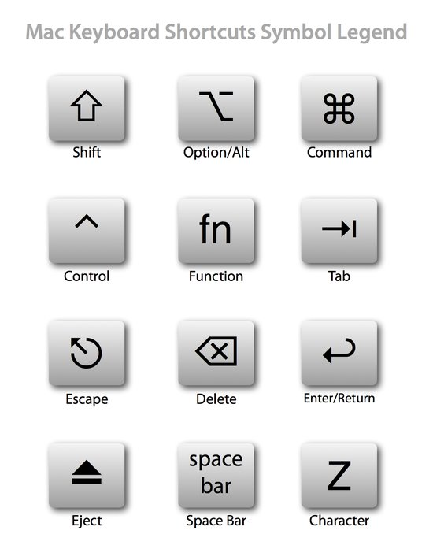

# Tools

- Homebrew 包管理工具
- Homebrew Cask brew-cask 允许你使用命令行安装 OS X 应用。
- iTerm2 更为强大的终端应用，是 Terminal 应用的替代品
- Zsh 一款功能强大终端（shell）软件，既可以作为一个交互式终端，也可以作为一个脚本解释器。
- Oh My Zsh 简化命令行操作
- [作业部落](https://www.zybuluo.com) > MacDown/mou markdown编辑器
- CheatSheet CheatSheet 能够显示当前程序的快捷键列表，默认的快捷键是长按⌘
- SourceTree Git 图形化客户端
- Alfred 不用鼠标键盘快速打开软件，另可结合Workflows做更多事情（==收费==）
- [CheatSheet](https://www.cheatsheetapp.com/CheatSheet/) 长按⌘键，查看该软件所有快捷键
- [Dash](https://kapeli.com/dash) 离线文档
- [Licecap](http://www.cockos.com/licecap/) 划定区域，快速制作gif
- [spectacleapp](https://www.spectacleapp.com/) 简易窗口管理工具，可分屏。
- [bettertouchtool](https://www.boastr.net/) 强大的自定义命令操作（==收费==）

# Hotkey

- 截屏
  - Command-Shift-3：截取全部屏幕到文件
  - Command-Shift-Control-3：截取全部屏幕到剪贴板
  - Command-Shift-4：截取所选屏幕区域到一个文件，或按空格键仅捕捉一个窗口
  - Command-Shift-Control-4：截取所选屏幕区域到剪贴板，或按空格键仅捕捉一个窗口

- 应用程序
  - Command-H：隐藏当前
  - Command-Option-H：隐藏其他
  - Command-Q：退出
  - Command-Shift-Z：重做 ＝ 撤销的逆向操作
  - Command-Tab：切换
  - Command-Option-esc：强制退出

- 文本
  - Command-右箭头：将光标移至当前行的行尾
  - Command-B：切换所选文字粗体（Bold）显示
  - fn-Delete：相当于PC全尺寸键盘上的Delete，也就是向后删除
  - fn-上箭头：向上滚动一页（Page Up）
  - fn-下箭头：向下滚动一页（Page Down）
  - fn-左箭头：滚动至文稿开头（Home）
  - fn-右箭头：滚动至文稿末尾（End）
  - Command-右箭头：将光标移至当前行的行尾
  - Command-左箭头：将光标移至当前行的行首
  - Command-下箭头：将光标移至文稿末尾
  - Command-上箭头：将光标移至文稿开头
  - Option-右箭头：将光标移至下一个单词的末尾
  - Option-左箭头：将光标移至上一个单词的开头
  - Control-A：移至行或段落的开头

- Finder
  - Command-Shift-N：新建文件夹（New）
  - Command-Shift-G：调出窗口，可输入绝对路径直达文件夹（Go）
  - return 选取文件名
  - Command-O / Command-下箭头：打开所选项
  - Command-上箭头：上一层文件夹
  - Command-Option-V：剪切性粘帖
  - Command-Delete：将文件移至废纸篓
  - Command-Shift-Delete：清倒废纸篓
  - 空格键：预览

- 浏览器
  - Command-L：光标直接跳至地址栏
  - Control-Tab：转向下一个标签页
  - Control-Shift-Tab：转向上一个标签页
  - Command-加号或等号：放大页面
  - Command-减号：缩小页面 
