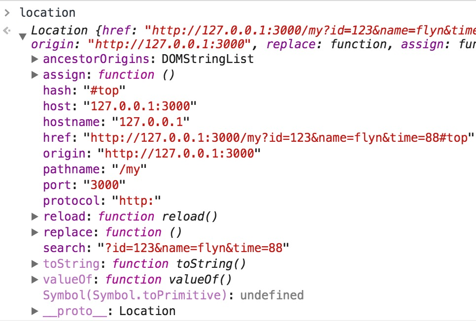

## [Location](https://developer.mozilla.org/zh-CN/docs/Web/API/Location)



> location.assign()

加载给定URL的内容资源到这个Location对象所关联的对象上

```
// 当前页http://127.0.0.1:3000/my
location.assign('info')
// 页面将跳转到http://127.0.0.1:3000/info
```

> location.reload()

重新加载来自当前 URL的资源。参数若为true，强制从服务器上重新加载数据。

> location.replace()

用给定的URL替换掉当前的资源。与 assign() 方法不同的是用 replace()替换的新页面不会被保存在会话的历史 History中，这意味着用户将不能用后退按钮转到该页面。

## [History](https://developer.mozilla.org/zh-CN/docs/Web/API/History)

> history.length

返回会话历史中元素的数目，包括当前加载的页

> history.state

返回一个表示历史堆栈顶部的状态的值。由pushState、replaceState添加修改。

> history.back()

回退到会话历史中的上一页，等同于history.go(-1)

> history.forward()

前进到会话历史中的下一页，等同于history.go(1)

> history.go()

在会话历史中前进/后退的页数

> history.pushState(state, title, url)

向浏览器历史添加了一个状态，但不会引起页面刷新或hashChange。

- state 是个object，与历史纪录相关的JS对象。新建后将存储在history.state中,可以用在popstate事件中。
- title 标题字符串。现在大多数浏览器不支持或者忽略这个参数，最好用null代替
- url 新历史纪录的地址。

> history.replaceState(state, title, url)

与pushState类似，前者是新增，而replaceState是替换当前的记录值

> window.onpopstate = function(event){...}

只会在浏览器某些行为下触发, 比如点击后退、前进按钮，但不包括pushState和replaceState

**pushState、replaceState、onpopstate均需IE10+，需处理以下兼容性可用[history.js](https://github.com/browserstate/history.js)**

## [Document](https://developer.mozilla.org/zh-CN/docs/Web/API/Document)

> document.referrer

获取前一个访问页面的URL地址，若无则为空。

[页面链接跳转历史URL不记录的兼容处理](http://www.zhangxinxu.com/wordpress/2017/02/page-link-url-history-null-not-record/)

```
var fnUrlReplace = function (eleLink) {
    if (!eleLink) {
        return;
    }
    var href = eleLink.href;
    if (href && /^#|javasc/.test(href) === false) {
        if (history.replaceState) {
            history.replaceState(null, document.title, href.split('#')[0] + '#');
            location.replace('');
        } else {
             location.replace(href);
        }
    }
}

document.getElementsByTagName('a')[0].onclick = function (event) {
    if (event && event.preventDefault) {
        event.preventDefault();
    }
    fnUrlReplace(this);
    return false;
}
```

## Encode

> encode(str)

对统一资源标识符（URI）进行编码（针对完整URI）。以下字符将保留不编码：

| 类型 | 包含 |
| --- | --- |
| 保留字符 | ; , / ? : @ & = + $ |
| 非转义的字符 | 字母 数字 - _ . ! ~ * ' ( ) |
| 数字符号 | # |

> encodeURIComponent(str)

对统一资源标识符（URI）的组成部分进行编码。转义除了字母、数字、(、)、.、!、~、*、'、-和_之外的所有字符。

> decodeURI(str)

解码由 encodeURI 方法或者其它类似方法编码的统一资源标识符（URI）。如解决中文url的乱码问题。

```
decodeURI("https://developer.mozilla.org/ru/docs/JavaScript_%D1%88%D0%B5%D0%BB%D0%BB%D1%8B");
// "https://developer.mozilla.org/ru/docs/JavaScript_шеллы"
```

> decodeURIComponent(str)

解码由 encodeURIComponent 方法或者其它类似方法编码的部分统一资源标识符（URI）

```
decodeURIComponent("JavaScript_%D1%88%D0%B5%D0%BB%D0%BB%D1%8B");
// "JavaScript_шеллы"
```


